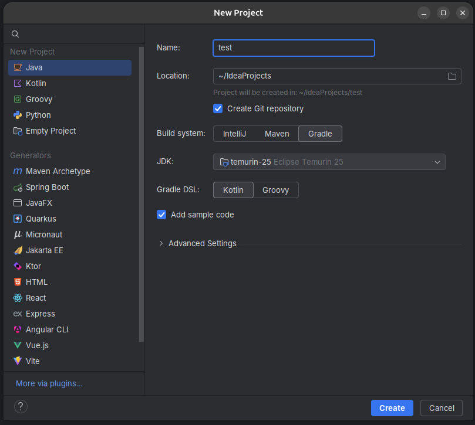

## Prerequisites

- Install [sdkman](https://sdkman.io/)

## Install JDK 25

- Open a terminal
- Install Java:

```bash
sdk install java 25-tem
```
- Open a new terminal
- Verify the installation, make sure that the version is "25" and the name contains "OpenJDK Runtime Environment Temurin":

```bash
java -version
```
- The output should look like this:

```bash
openjdk version "25" 2025-09-16 LTS
OpenJDK Runtime Environment Temurin-25+36 (build 25+36-LTS)
OpenJDK 64-Bit Server VM Temurin-25+36 (build 25+36-LTS, mixed mode, sharing)
```

## Install Gradle

- Install Gradle:

```bash
sdk install gradle 9.3.1
```
- Open a new terminal
- Verify the installation, make sure that the version is "9":

```bash
gradle -version
```
- The output should look like this:

```bash
------------------------------------------------------------
Gradle 9.3.1
------------------------------------------------------------
```

## Install Git (optional)

- Install [Git](https://git-scm.com/install/linux)
- Verify the installation:

```bash
git -v
```
- The output should look like this:

```bash
git version 2.51.0
```

## Install IntelliJ

- Install the [JetBrains Toolbox](https://www.jetbrains.com/help/toolbox-app/toolbox-app-silent-installation.html#toolbox_linux)
- Open JetBrains Toolbox and click "install" on "IntelliJ IDEA".
- Open IntelliJ and create a new Java project:
    - Name: test
    - Location: "~\IdeaProjects"
    - Build system: Gradle
    - JDK: Eclipse Temurin 25
    - Gradle DSL: Kotlin
    - Add Sample Code: yes



- In your project open "src/main/java/org.example/Main.java"
- Press the green play button next to the main method and verify that everything works correctly