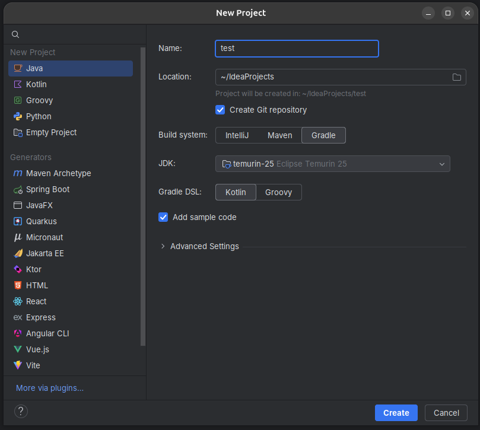

## Prerequisites

Install [homebrew](https://brew.sh/)

## Install JDK 25

- Open terminal
- Install Java:

```zsh
brew install --cask temurin@25
```
- Verify the installation, make sure that the version is "25" and the name contains "OpenJDK Runtime Environment Temurin":

```zsh
java -version
```
- The output should look like this:

```zsh
openjdk version "25" 2025-09-16 LTS
OpenJDK Runtime Environment Temurin-25+36 (build 25+36-LTS)
OpenJDK 64-Bit Server VM Temurin-25+36 (build 25+36-LTS, mixed mode, sharing)
```

## Install Gradle

- Install Gradle:

```zsh
brew install gradle@9
```

- Verify the installation, make sure that the version is "9":

```zsh
gradle -version
```

- The output should look like this:

```zsh
------------------------------------------------------------
Gradle 9.3.1
------------------------------------------------------------
```



## Install IntelliJ

- Install the JetBrains Toolbox:
```zsh
brew install --cask jetbrains-toolbox
```

- Open JetBrains Toolbox and click "install" on "IntelliJ IDEA".
- Open IntelliJ and create a new Java project:
    - Name: test
    - Location: "~\IdeaProjects"
    - Build system: Gradle
    - JDK: Eclipse Temurin 25
    - Gradle DSL: Kotlin
    - Add Sample Code: yes



- In your project open "src/main/java/org.example/Main.java"
- Press the green play button next to the main method and verify that everything works correctly

