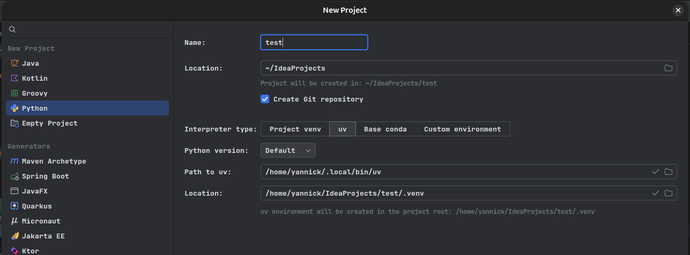

## Install UV

- Install [UV](https://docs.astral.sh/uv/getting-started/installation/)
- Verify the installation:

```powershell
uv --version
```
- The output should look like this:

```powershell
uv 0.10.4
```



## Install IntelliJ

- Install the [JetBrains Toolbox](https://www.jetbrains.com/toolbox-app/)
- Open JetBrains Toolbox and click "install" on "IntelliJ IDEA".
- Open IntelliJ and create a new Python project:
    - Name: test
    - Location: "~\IdeaProjects"
    - Interpretor type: "uv"
    - Python version: default
    - Path to uv: `DO NOT CHANGE`
    - Location: `DO NOT CHANGE`
- In your new project: create a file called `helloWorld.py`
- Add the code `print("Hello World")`
- Right click on the file and click `Run 'helloWorld'`



