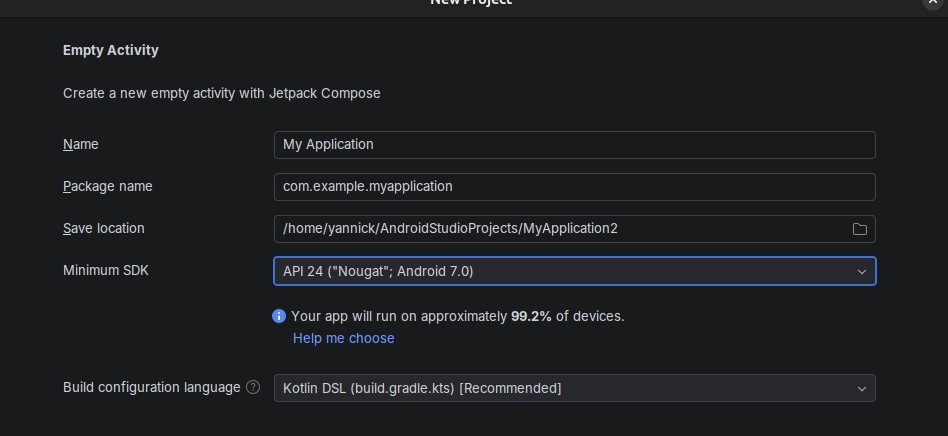





## Install Android Studio

- Open JetBrains Toolbox and click "install" on "Android Studio".
- Open Android Studio and create a new project:
    - Phone and large screens: "Empty Activity".
    - Leave everything set to the defaults.

- Install an emulated device:
  - Tools > Device Manager > Create Virtual Device 
  - Select "Small Phone"
  - Finish the installation, this takes some time.
- Press the green play button and select "Small Phone" as a target device. Verify that yor app is showing up correctly.

## Android Debugging Bridge (optional)

You can use your device for debugging.
This is very handy for working with internal phone hardware like the acceleration sensors.
**Note: make sure you have a fast and reliable USB-C cable.**

- Enable adb on your phone: [Adb Enabling](https://developer.android.com/tools/adb#Enabling)
- Press the green play button and select `<Your Phone Name>` as a target device. Verify that yor app is showing up correctly.
